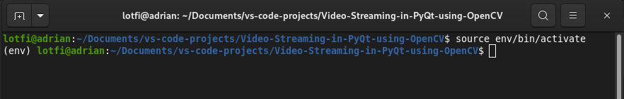
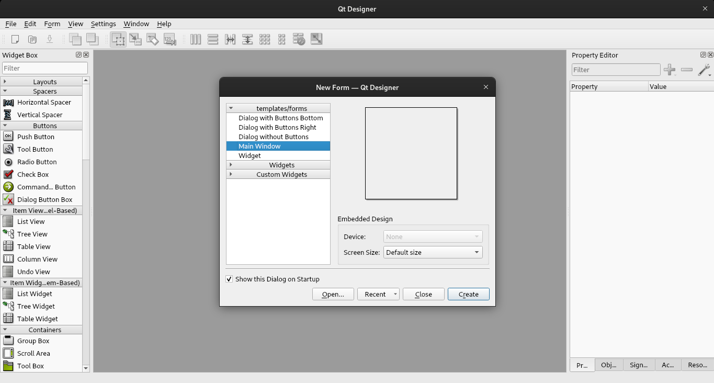
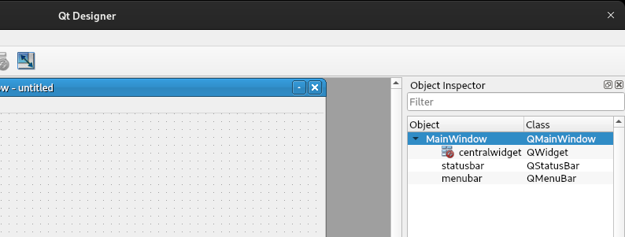

# Video Streaming in PyQt using OpenCV

This tutorial shows  how to build a desktop application with modern GUI for video streaming in python using PyQt and OpenCV.

## Creating a virtual environment and installing the required packages 

We assume that ***python***, ***pip*** and ***virtualenv*** are already installed.
For more details about Pip and Virtual Environment , please refer to this [link]: https://packaging.python.org/en/latest/guides/installing-using-pip-and-virtual-environments/	"Using Pip and Virtual Environment"

### Creating a virtual environment

- Create an initial project directory and name it for example: ***Video-Streaming-in-PyQt-using-OpenCV*** 

- Using ***Terminal*** (or ***cmd*** ...), navigate to your project root directory: 

  ```shell
  cd path_to_your_project_directory
  ```

  In my case :

  ```shell
  cd /home/lotfi/Documents/vs-code-projects/Video-Streaming-in-PyQt-using-OpenCV
  ```

  Or simply, navigate to your project directory in your file manger ->  mouse right click -> Open Terminal here.

- Create a virtual environment and name it for example ***env***:

  ```shell
  python3 -m venv env
  ```

- Activate the virtual environment that we created: 
  ```shell
  source env/bin/activate
  ```

  The output should be as in the following image, where you can see the name of your environment at the beginning of the line:
  
  
  
  
  
### Installing the required packages:

After activating the virtual environment, to install the PyQt5 package,  type in terminal: 

  ```shell
  python3 -m pip install PyQt5
  ```

and   to install OpenCV 

```shell
python3 -m pip install opencv-python-headless
```

## Creating GUI using Qt5 Designer

The simplest way to create a PyQt GUI application is use Qt5 Designer. 

### Installation

If you have not yet installed Qt5 Designer, you can install it using pip:

```shell
python3 -m pip install pyqt5-tools
```

and to run it, type: 

```shell
qt5-tools designer
```


You can also install Qt5-Designer globally in your system, for example, to install it on ***debian***:

```
sudo apt install qttools5-dev-tools
```

and to run it using Terminal, enter :

```
designer
```

On ***Windows*** and ***Mac***, one can download it from this [link]: https://build-system.fman.io/qt-designer-download, and then, install it.

### Creating the GUI

- Run designer -> select Main Window -> Press Create



- In Object inspector, remove menu and statusbar:



- Drag two frames from the Widgets Box to the Main Window
